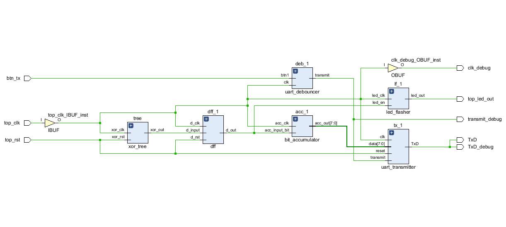
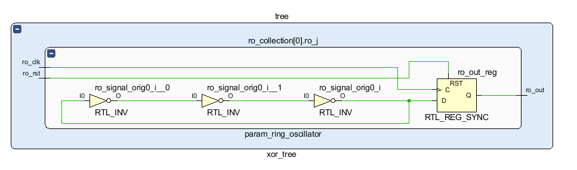
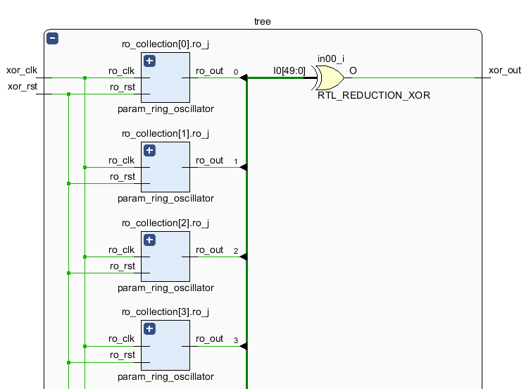
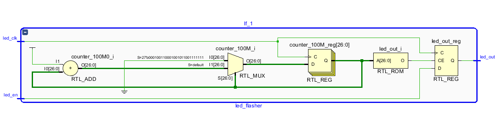

# CZ4010
### Hardware Implementation of a True Random Number Generator

### Overview

This project aims to implement a cryptographically secure hardware random number generator by following one of the most cited TRNG design by Wold, Tan, in ["Analysis and Enhancement of Random Number Generator in FPGA Based on Oscillator Rings".](https://www.hindawi.com/journals/ijrc/2009/501672/) We would like to verify whether this design can be implemented on an entry level FPGA board while producing an output bitstream that passes the NIST 800-22 randomness test suite. 

According to Wold, Tan's design, inherent jitter within the ring oscillator (RO) structure provides the source of entropy. The degree of randomness that follows can be further improved by creating multiple ROs and connecting their output to an XOR-tree, where an output bit will be sampled at each clock cycle.

The design is done on Verilog, synthesised and implemented using Vivado on an entry level Basys3 FPGA board. We have provided all the [source files](hdl_src/) and [constraint file](hdl_constraints/) in this repository. No test bench was included since the output of RO structures in Vivado's simulator is constantly undefined (X).

If you'd like to verify the design, please make sure to install the Basys 3 board file into Vivado by copying it to the installation folder. The board file is also included in the repository.

### Design

All the relevant diagrams can be found in the schematic folder.

The overall design includes the following components:
- RO structure
- XOR tree
- Bit accumulator
- UART button debouncer
- UART transmitter
- LED flasher

### RO structure

Following the design outlined by the paper, we have created a three-stage RO with a D-flip-flop sampling its output at every clock cycle. These ROs are instantiated in the XOR-tree module. 

### XOR tree

A total of 50 RO structure are implemented in parallel and their output connected to an XOR tree. The tree produces a single bit that is also sampled by a D-flip-flop at every clock cycle.

### Bit accumulator

Packages each individual bit sampled from the XOR tree into a single byte to be delivered by the UART transmitter. The bit accumulator changes its output every 8 clock cycles, fast enough as the UART transmitter only reads the bit accumulator's output once every +- 800 clock cycles (when the transmission rate is 100MHz and the baud rate is 115200).

### LED flasher

We implemented a module that samples the output of the XOR tree every 200ms and routes it to one of the LED on the Basys 3 board. This is done mostly to debug the RO structure to make sure that the bit generation is working properly. The LED should periodically flash at a random rate if the bit generation is truly random. We used LED U16 at the bottom right corner of the board.

### UART Transmitter and Debouncer

Due to time constraints, these two modules we did not implement from scratch. They are taken and slightly modified from [Instructables](https://www.instructables.com/UART-Communication-on-Basys-3-FPGA-Dev-Board-Power/). When pressed, the button produces the 'to transmit' signal for the transmitter to start sending the output bytes from the accumulator to the host PC.

### Results

At a clock rate of 100MHz and 115200 baud rate, we read approximately 1.4mb of binary output using the TeraTerm software available in the labs. The binary file can be found in the [sample_bitstream_output](sample_bitstream_output/) folder.

The output needs to be slightly more than 1mb as the official [NIST 800-22](https://csrc.nist.gov/Projects/Random-Bit-Generation/Documentation-and-Software) test suite can only produce a comprehensive enough test result when the input is 10 bitstreams of 1000000 bits (total 1.25mb). We have verified that Wold, Tan's design with 50 3-stage ROs does pass all the NIST test suite with the exception of "randomexcursion" algorithm tests, since those require an input bitstream of more than 100mb. 

The complete result can be found in the [NIST folder](NIST/nist_800_22_results/), summarised in the [finalAnalysisReport](NIST/nist_800_22_results/finalAnalysisReport.txt).

